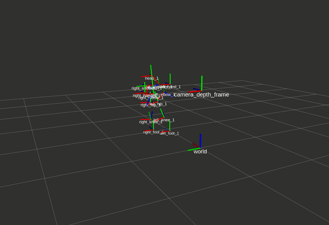

# openni2_tracker



The *openni2_tracker* broadcasts the OpenNI skeleton frames using [ROS tf](http://wiki.ros.org/tf). It is the new version of the [openni_tracker](https://github.com/ros-drivers/openni_tracker) using [OpenNI2](https://structure.io/openni) and NiTE2. The original version can be found [here](https://github.com/ros-drivers/openni2_tracker).

*openni2_tracker* can be used with various sensors, including *Xtion PRO LIVE*, *Kinect 2*, *RealSense D4xx*, etc. The following takes **Intel RealSense D455** as an example to introduce the installation steps. Please test other cameras yourself and **very welcome to push related tutorials**.

#### Test environment
  - [Ubuntu 18.04](https://releases.ubuntu.com/18.04/) + [ROS Melodic](http://wiki.ros.org/melodic/Installation/Ubuntu)

#### Install the ROS Wrapper for Intel RealSense Devices
  - `sudo apt install ros-melodic-realsense2-camera` (this will install *ros-melodic-librealsense2* for you)
  - Downloads [99-realsense-libusb.rules](rules/99-realsense-libusb.rules) and `sudo mv 99-realsense-libusb.rules /etc/udev/rules.d/`
  - Plug in the camera to test: `roslaunch realsense2_camera rs_camera.launch filters:=pointcloud`
  - For more details, please refer to [here](https://github.com/IntelRealSense/realsense-ros).

#### Install openni2_tracker
  - Clone the repository
```
cd ~/catkin_ws/src
git clone https://github.com/yzrobot/openni2_tracker.git
```
  - Please note that the content of `NiTE-Linux-x64-2.2` cannot be provided due to copyright reasons, please Google it by yourself.
  - Copy `openni2_tracker/drivers/librs2driver.so` (for RealSense D4XX, different drivers may be needed for other types of cameras and operating systems) to the following four locations:
```
cp openni2_tracker/drivers/librs2driver.so openni2_tracker/OpenNI-Linux-x64-2.2/Tools/OpenNI2/Drivers/
cp openni2_tracker/drivers/librs2driver.so openni2_tracker/OpenNI-Linux-x64-2.2/Samples/Bin/OpenNI2/Drivers
cp openni2_tracker/drivers/librs2driver.so openni2_tracker/OpenNI-Linux-x64-2.2/Redist/OpenNI2/Drivers/
cp openni2_tracker/drivers/librs2driver.so openni2_tracker/NiTE-Linux-x64-2.2/Samples/Bin/OpenNI2/Drivers/
```
  - Add the following code to `~/.bashrc`:
```
# OpenNI2 and NiTE2
export OPENNI2_INCLUDE=~/catkin_ws/src/openni2_tracker/OpenNI-Linux-x64-2.2/Include
export OPENNI2_REDIST=~/catkin_ws/src/openni2_tracker/OpenNI-Linux-x64-2.2/Redist
export NITE2_INCLUDE=~/catkin_ws/src/openni2_tracker/NiTE-Linux-x64-2.2/Include
export NITE2_REDIST64=~/catkin_ws/src/openni2_tracker/NiTE-Linux-x64-2.2/Redist
```
  - Compile
```
source ~/.bashrc
cd ..
catkin_make
```
  - Run

If you run `rosrun openni2_tracker openni2_tracker` you might get an error `Could not find data file ./NiTE2/s.dat
current working directory = ~/catkin_ws`. So it's better to run `roslaunch openni2_tracker openni2_tracker.launch` and establish a symbolic link before that `ln -s ~/catkin_ws/src/openni2_tracker/NiTE-Linux-x64-2.2/Redist/NiTE2 ~/.ros/NiTE2`.